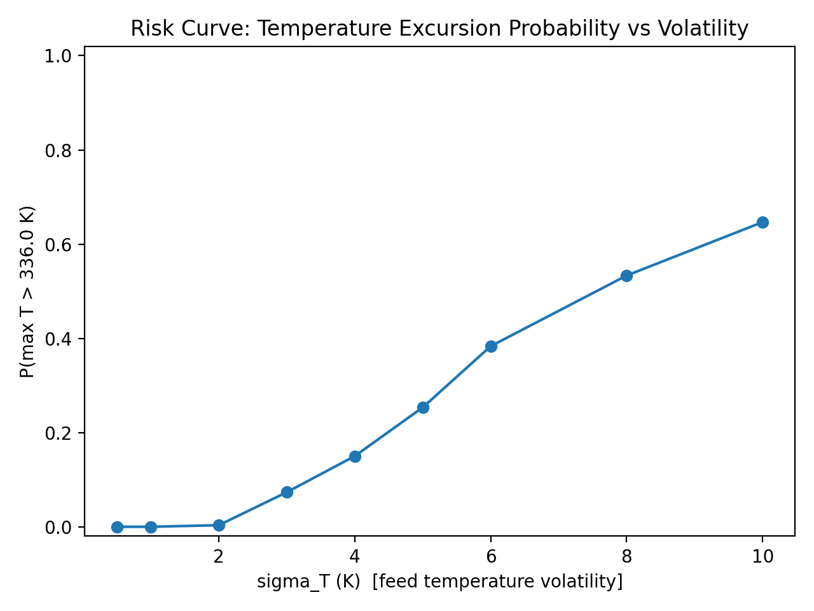

🌐 Live site: https://lrizzuto2.github.io/cstr-risk-analysis/
📓 Full report: CSTR_Risk_Report.ipynb

# Monte Carlo Risk Analysis of a PID-Controlled CSTR

## Motivation

This project explores how classical control systems can be analyzed using
modern risk frameworks (Monte Carlo simulation, Value-at-Risk, CVaR),
bridging chemical engineering and quantitative finance.

## Overview
This project models a **Continuous Stirred Tank Reactor (CSTR)** with an exothermic reaction under **PID temperature control**, and performs a **Monte Carlo risk analysis** to quantify the probability of unsafe thermal excursions under stochastic feed disturbances.

The goal is to bridge **chemical process modeling** with **quantitative risk analysis**, using tools common in both engineering and capital markets (Monte Carlo simulation, Value-at-Risk, Conditional Value-at-Risk).

---

## System Description

The reactor is modeled using nonlinear balance equations.

### Mass Balance
$$
\frac{dC_A}{dt} = \frac{F}{V}(C_{A,in} - C_A) - r_A
$$

### Energy Balance
$$
\frac{dT}{dt} = \frac{F}{V}(T_{in} - T) + \frac{-\Delta H}{\rho C_p}\, r_A - \frac{UA}{\rho C_p V}(T - T_c)
$$

### Kinetics (Arrhenius)
$$
r_A = k_0 \exp\!\left(-\frac{E}{RT}\right) C_A
$$

A **PID controller** adjusts the coolant temperature $T_c$ to track a temperature setpoint.

---

## Uncertainty Model

The system is subjected to stochastic feed temperature disturbances:

$$
T_{in} \sim \mathcal{N}(\mu, \sigma_T)
$$

Multiple values of volatility $\sigma_T$ are tested to evaluate how uncertainty propagates into thermal risk.

---

## Risk Metrics

For each volatility level, a Monte Carlo simulation (300 runs) is performed and the following risk metrics are computed:

- **P(max T > limit)**: probability of exceeding a safety threshold during a run  
- **VaR95**: 95th percentile of the maximum reactor temperature  
- **CVaR95**: mean of the worst 5% maximum-temperature outcomes

These metrics are analogous to financial risk measures, but applied to a physical process.

---

## Key Result

The risk curve shows a **nonlinear increase** in failure probability with increasing volatility:

- Low volatility → negligible risk  
- Moderate volatility (around $\sigma_T \approx 4$–$5$ K) → material risk  
- High volatility (e.g., $\sigma_T = 10$ K) → large probability of threshold violation

---



## Files

- `cstr_pid.py` — nonlinear reactor + PID controller simulation  
- `cstr_pid_montecarlo.py` — Monte Carlo temperature trajectories  
- `risk_curve.py` — risk curve + VaR/CVaR computation (exports CSV + PNG)  
- `risk_curve.png` — saved risk curve plot  
- `risk_table.csv` — saved numerical results table  

---

## Conceptual Takeaway

Instead of asking:

> “Does my system track the setpoint?”

We ask:

> **“What is the probability and severity of unsafe outcomes under uncertainty?”**

This is the same conceptual shift used in financial tail risk modeling, reliability engineering, and safety-critical systems.
---

## How to Run

```bash
# run deterministic PID simulation
python3 cstr_pid.py

# run Monte Carlo temperature paths
python3 cstr_pid_montecarlo.py

# generate risk curve + CSV
python3 risk_curve.py
